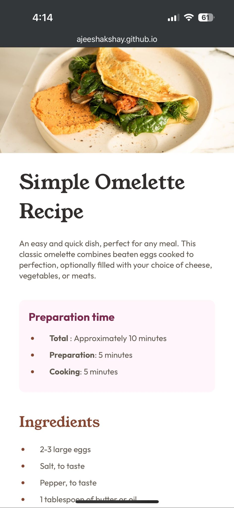

# Frontend Mentor - Recipe page solution

This is a solution to the [Recipe page challenge on Frontend Mentor](https://www.frontendmentor.io/challenges/recipe-page-KiTsR8QQKm). Frontend Mentor challenges help you improve your coding skills by building realistic projects. 

## Table of contentswqdasdasd

- [Overview](#overview)
  - [The challenge](#the-challenge)
  - [Screenshot](#screenshot)
  - [Links](#links)
- [My process](#my-process)
  - [Built with](#built-with)
  - [What I learned](#what-i-learned)
  - [Continued development](#continued-development)
  - [Useful resources](#useful-resources)
- [Author](#author)
- [Acknowledgments](#acknowledgments)

**Note: Delete this note and update the table of contents based on what sections you keep.**

## Overview

### Screenshot


The above is the desktop version


The above is the mobile version

### Links

- Solution URL: [https://www.frontendmentor.io/solutions/recipe-card-using-css-and-html-XHQYVpnq4L]
- Live Site URL: [https://ajeeshakshay.github.io/recipie-page/]

## My process

### Built with

- Semantic HTML5 markup
- CSS custom properties
- media queries

### What I learned

I got caught for a long time for setting te image width same as that of the parent container (recipe card). Later got to know I had put another div around the image. Finding bugs in the code is a special talent!!

To see how you can add code snippets, see below:

```
@media (max-width: 600px){
    
    body{
        width: 100%; 
        justify-content: flex-start;
        height: 100%;
    }
    .recipie-container{
        min-width: 0px;
        margin-top: 0;
        padding: 0rem;
        width: 100%; 
        /* background-color: var(--White); */
    }

    .container {
        padding: 0 2rem;
    }

    .image{
        width: 100%;
        border-radius: 0;
    }
}
```

### Continued development

I need to learn to find bugs faster. Practice making me better day by day

### Useful resources

- [Youtube](https://www.youtube.com/watch?v=maLLpMbhVFM) - I checked the video only to find how to put the dividers between each rows of the table (nutrition table).
    border-collapse: collapse;

## Author

- Website - [Add your name here](https://www.your-site.com)
- Frontend Mentor - [@yourusername](https://www.frontendmentor.io/profile/yourusername)
- Twitter - [@yourusername](https://www.twitter.com/yourusername)

**Note: Delete this note and add/remove/edit lines above based on what links you'd like to share.**

## Acknowledgments

This is where you can give a hat tip to anyone who helped you out on this project. Perhaps you worked in a team or got some inspiration from someone else's solution. This is the perfect place to give them some credit.

**Note: Delete this note and edit this section's content as necessary. If you completed this challenge by yourself, feel free to delete this section entirely.**
