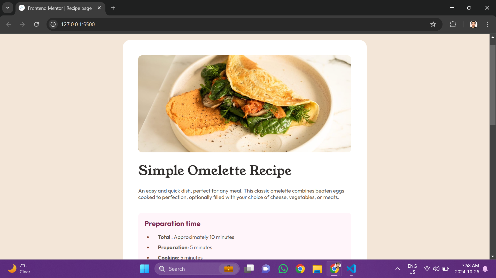

# Frontend Mentor - QR code component solution

This is a solution to the [Recipe page](https://www.frontendmentor.io/challenges/recipe-page-KiTsR8QQKm). Frontend Mentor challenges help you improve your coding skills by building realistic projects. 

## Table of contents

- [Overview](#overview)
  - [Screenshot](#screenshot)
  - [Links](#links)
- [My process](#my-process)
  - [Built with](#built-with)
  - [What I learned](#what-i-learned)
- [Author](#author)
- [Acknowledgments](#acknowledgments)

## Overview

### Screenshot

The above are the screenshots of desktop version

### Links

- Live Site URL: [https://ajeeshakshay.github.io/Social-links-profile/]

## My process

### Built with

- Semantic HTML5 markup
- CSS custom properties
- Flexbox
- CSS Grid
- pseudo-class

### What I learned

Tried pseudo-class for the first time in my projects.

## Author

- Github - [Akshay Ajeesh](https://github.com/ajeeshakshay)
- Frontend Mentor - [@ajeeshakshay](https://www.frontendmentor.io/profile/ajeeshakshay)

## Acknowledgments

I tried doing this code completely on my own even though I had referenced sites to know the pseudo-class for syntax.

